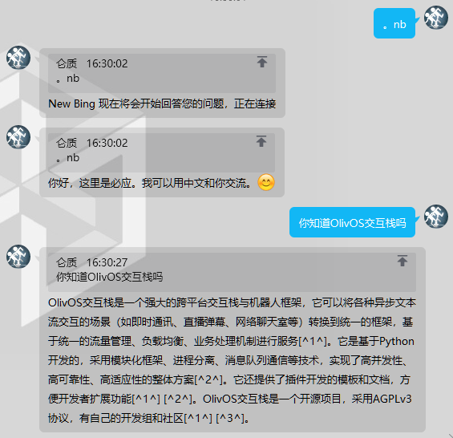

# newbingAIOlivOSPlugin

这是一个配合[New Bing](https://www.bing.com/new)使用的[OlivOS](https://github.com/OlivOS-Team/OlivOS)插件，可以将`New Bing`对话流对接到`OlivOS`所支持的交互场景。

## 开始之前
先说结论，本插件基于`Cookies`实现对微软账号的模拟登录，进而实现对`New Bing`的访问，所以想要正确使用本插件，你必须得先有一个能够使用`New Bing`服务的微软账号，本插件无法帮助你更快的获取`New Bing`服务的测试资格，也无法帮你绕开`New Bing`对于名额的限制，并且对你使用本插件可能导致的失去资格，甚至账号被封禁的风险不负任何责任。

## 开始使用
1. 下载 `Cookie-Editor`  
   这取决于你的浏览器，通常来说`New Bing`会强制要求你使用`Edge`浏览器，那么你应当在`Edge`的扩展市场获取：  
   [Cookie-Editor](https://microsoftedge.microsoft.com/addons/detail/cookieeditor/neaplmfkghagebokkhpjpoebhdledlfi)  
     
   此外，如果你使用`Chrome`，那么我相信你既然有能力解决浏览器伪装的问题，也一定有能力解决`Google`在特定地区的网络封锁问题，那么你可以在`Chrome`扩展市场获取对应的版本：  
   [Cookie-Editor](https://chrome.google.com/webstore/detail/cookie-editor/hlkenndednhfkekhgcdicdfddnkalmdm)  
     
2. 登录你的微软账号并确保可以正确访问`New Bing`  
   请确保你可以在登录微软账号的情况下使用`New Bing`，你可以在这个页面尝试：  
   [聊天模式只有在你访问了新必应之后才能使用。](https://www.bing.com/search?q=Bing+AI&showconv=1)  
   正确使用的迹象如下：  
     
   无法正确使用的迹象如下：  
     
3. 获取`Cookies`  
   确保了你可以正确使用`New Bing`后，请进入聊天页面，然后使用前文所提到的`Cookie-Editor`插件，点击`Export -> Export as JSON`，将全部的`Cookies`信息复制到剪贴板。  
     
4. 导入`Cookies`  
   右键右下角任务连托盘中的`OlivOS`图标打开菜单，点击`插件菜单 -> NewBing人工智能 -> 修改Cookies`  
     
   在用记事本打开的文件中粘贴剪贴板中的内容，保存并关闭。  
     
5. 启用代理  
   对于大多数情况，你都需要通过代理才能访问`New Bing`，并且既然你已经获取了资格，我们默认你有能力完成代理的使用。  
   在此处我们仅指出，作为一个OlivOS插件，你应当在你的代理工具中开启`系统代理`功能，以将代理应用至插件的网络设置。  
6. 投入使用  
   至此，如果设置妥当，你应当可以开始使用了。  
     

## 使用指令
| 指令 | 功能 |
| :-: | :-- |
| .nb | 发起一对一的对话 |
| .nbg | 发起多对一的对话 |
| .bye | 结束对话 |

## 注意事项
特别需要注意的是，本插件仅适用于`Python 3.8+`，所以不可在适配`Win7`版本的`OlivOS`中使用，使用发布版请使用`0.11.7`以后版本的`OlivOS`，否则会缺少必要的依赖库

## 鸣谢
本插件基于以下项目开发  
[OlivOS](https://github.com/OlivOS-Team/OlivOS)  
[EdgeGPT](https://github.com/acheong08/EdgeGPT)  
[NewBing](https://www.bing.com/new)  
